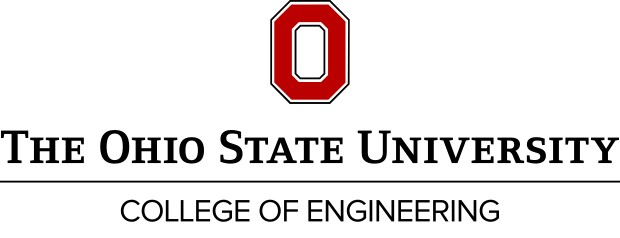
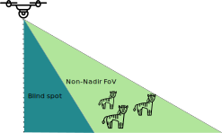
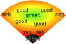
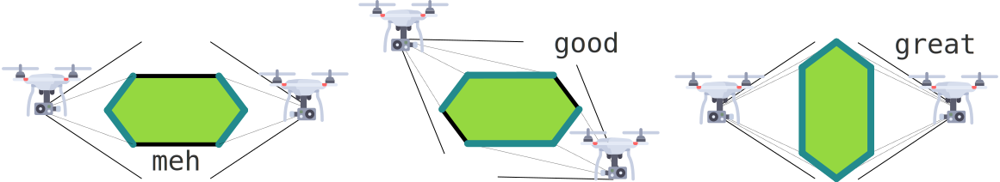
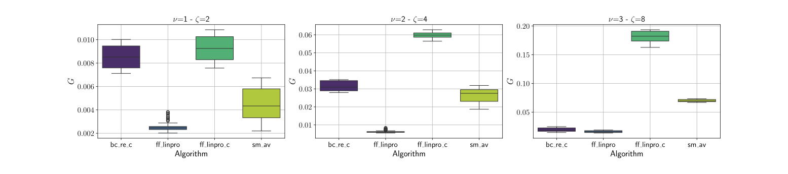
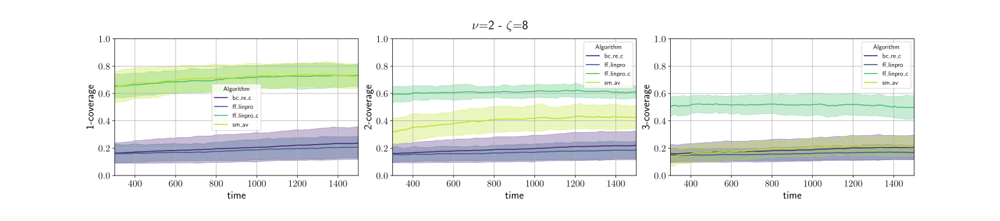
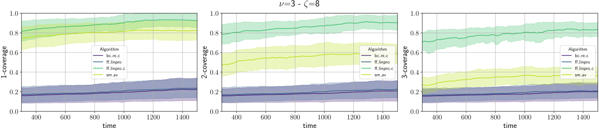
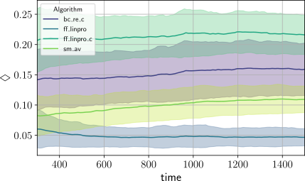
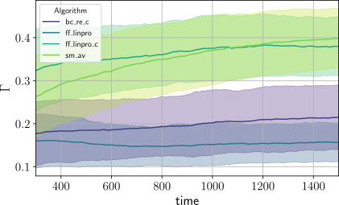
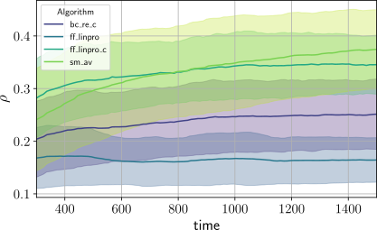

+++

title = "Decentralized Multi-Drone Coordination for Wildlife Video Acquisition"
description = "ACSOS 2024 main-track paper presentation"
outputs = ["Reveal"]

+++



background image adapted from: Diego Delso, delso.photo, License CC BY-SA

# Decentralized Multi-Drone Coordination for Wildlife Video Acquisition

[Denys Grushchak](denys.grushchak@studio.unibo.it) <i class="fa-solid fa-computer"></i>,
[Jenna Kline](kline.377@osu.edu) <i class="fa-solid fa-horse"></i>,
[Danilo Pianini](danilo.pianini@unibo.it) <i class="fa-solid fa-computer"></i>,  
[Nicolas Farabegoli](nicolas.farabegoli@unibo.it) <i class="fa-solid fa-computer"></i>,
[Gianluca Aguzzi](gianluca.aguzzi@unibo.it) <i class="fa-solid fa-computer"></i>,
[Martina Baiardi](m.baiardi@unibo.it) <i class="fa-solid fa-computer"></i>,
and
[Christopher Stewart](cstewart@cse.ohio-state.edu) <i class="fa-solid fa-horse"></i>

{}
{}

<i class="fa-solid fa-computer"></i> Department of Computer Science and Engineering, University of Bologna, Cesena (FC), Italy
{}
{}

<i class="fa-solid fa-horse"></i> Computer Science and Engineering Department, The Ohio State University, Columbus (OH), USA
{}
{}

---



# Wildlife behavior acquisition

A paramount tool for *ethologists* and *biologists* to gather insights into the nature and inform
**conservation** efforts for **endangered species**.

* {} Animal *health* monitoring {}
* {} *Behavioral changes* induced by *climate change* or *human activity*{}
* {} Current *population level*{}
* {} Insights into *future population levels*{}

---



background image: Abujoy, License CC BY-SA

---



background image derived from: Abujoy, License CC BY-SA

---



# GPS collars

* {} Great position tracking
* {} Possibly equipped with further sensors (temperature, accelerometer...)
* {} Long battery life
* {} No video
* {} Invasive (requires capture and release) $\Rightarrow$ Limited sample size

---



author: Arddu, License CC Attribution 2.0 Generic

---



author: Winterline, License CC Attribution-Share Alike 3.0 Unported

---



author: Kalyan Varma, License CC BY-SA

---



---



author: Prashanthns, License CC BY-SA

---



# Camera traps

* {} Photos and potentially videos
* {} Non-invasive
* {} Multiple species
* {} Static and with limited range
* {} False triggers
* {} Subject to vandalism and theft
* {} Generally fragile (the tiger in the first picture destroyed the camera)

---



---



# Fixed-wing drone aerial views

* {} *Very large area* coverage
* {} *Long flights*
* {} **Nadir** imagery: good for mapping, bad for *individual behavior*
* {} Requires *specialized training*
* {} *Predefined* flight paths

---



---



## Non-nadir perspective

---



# Quadcopters and similar drones

{}
{}
* {} *Large area* coverage
    * Although much *smaller than fixed-wing* drones
* {} **Non-Nadir** view is great for *individual behavior*
* {} **Multiple** drones can get *different perspectives*
* {} **Dynamic trajectories**
* {} *Noise* may disturb wildlife
* {} Relatively *short battery life*
* {} *Skilled pilots* required
    * {} **Practically impossible** to coordinate multiple drones effectively by hand
{}
{}
{}
<image src="jenna-drone.jpg" style="height: 15em" /><image src="flyingdronefromlandrover.png" style="height: 15em" />
{}
{}
{}

{}
### $\Rightarrow$ **Multi-Drone Coordination**
* *No* need for *human pilots*
* Similar to *well-known problems in the literature*!
{}

---



# A special OMOkC

In the *Online Multi-Object k-Coverage* (**OMOkC**) problem,
dones coordinate to cover each *interesting* target with at least $k$ points of view.

<video width="1600" height="450" autoplay muted loop>
  <source src="omokc.mp4" type="video/mp4">
  <source src="omokc.webm" type="video/webm">
  Your browser does not support the video tag.
</video>

Our problem is a variant of OMOkC, in which:

1. {}The focus is on animal *groups* rather than single animals $\Rightarrow$ **Herd tracking**{}
2. {}Drones have a *blind zone* due to their non-nadir point of view $\Rightarrow$ **Blind zone**{}
3. {}The *position* of animals within the Field-of-View dramatically changes the quality of the result $\Rightarrow$ **FoV centrality**{}
4. {}The *angle* at which a subject is being observed matters, lateral views are more informative than frontal ones $\Rightarrow$ **Observation angle**{}
5. {}Observers emit *noise* that may alter the behavior of the observed animals $\Rightarrow$ **Noise pollution**{}
6. {}Observation is performed in contexts with *limited infrastructure* $\Rightarrow$ **Decentralized coordination**{}

---



# Contribution

## A methodology to evaluate the performance in wildlife video acquisition

We define **metrics** for:
1. The *centrality* in the Field-of-View of each camera
2. The overall *angles* of observation of each animal
3. The *noise* pollution generated by the drones

We build simulations based on a novel *herd simulation* algorithm based on the [KABR dataset](https://doi.ieeecomputersociety.org/10.1109/WACVW60836.2024.00011) 
(Jenna presented the algorithm at SISSY on Monday)

{}

$\Rightarrow$ We observe that *pre-existing OMOkC algorithms do not perform as well as expected in our context*,
and thus we propose to extend the current SOTA with:

## An herd-aware decentralized multi-drone coordination algorithm

{}

---



# FoV Centrality

* Let $P_c$ be the center of the FoV $\mathcal{V}$ of camera $c$.
* Let $F(c)$ be the maximum distance from the center of the FoV

then

$F(c) = \max \left\| P - P_c \right\| ~ \forall P \in \mathcal{V}$.

* For any camera $c$, *$F(c)$* represents the *worst possible position* in its FoV.
* For an animal $z$ located in $P_z$, a normalized estimate of *how poorly* it is positioned in the FoV of $c$ is:
the ratio between its distance to the center and $F(c)$:
$\frac{\left\| P_z - P_c \right\|}{F(c)}$
* The *normalized FoV centrality* for a target animal $z$ and a drone $c$ is then: $Q(z, c) = 1 - \frac{\left\| P_z - P_c \right\|}{F(c)}$
* Generalized for a set of cameras $C$ observing a target $z$: $\Gamma(z) = \max_{c \in C} Q(z, c)$

{}
{}{}
### TL;DR: the closer to the center, the better
* find the *worst possible position* to be used as *bound*
* use that to estimante *how good is the **animal** position for **each camera***
* *for **each animal***, *consider only the **best camera***
{}{}

{}{}
{}

---



# Observation angle: body coverage

**Ideas**
1. the best observation comes from a perfectly *perpendicular angle*
2. the "*longer*" *the side* of the animal that is being observed, the better the observation
    * that's why observations from the side are more valuable than frontal or back ones
3. *small deviations* from perpendicularity are not that bad

1. *approximate* the animal's body with a polygon
2. for each segment $s$ find the camera $c$ observing the segment midpoint from the smallest angle $\alpha_s$: $c$ has the best available view for $s$
3. normalize $\alpha_s$ in $[0, 1]$ with $\Phi: [-\frac{\pi}{2}, \frac{\pi}{2}]\rightarrow{}[0, 1]$.
4. use a logistic function to penalize more the *extreme* angles: $\Phi(x;\mu,\nu)=\left[1+\left(\frac{x(1-\mu)}{\mu(1-x)}\right)^{-\nu}\right]^{-1}, \mu=\frac{1}{2}, \nu=5$
5. get the *observation quality* for $s$: $\xi(s) = \Phi\left(\frac{|\alpha_s|}{\frac{\pi}{2}}; \frac{1}{2}, 5\right)$.
6. *repeat for every "side"* of the animal in $S_z$ to get the **body coverage** $\Diamond(z) = \frac{\sum_{s \in{} S_z} \|s\| \cdot \xi(s)}{\|S_z\|}$

---



# Noise pollution

We need the *Sound Pressure Level* $L_P$ at the position of the animal.

Of course, manufacturers only provide the *Sound Power Level* $L_W$, a measure of the sound energy emitted by the drone.

To convert into the SPL at distance $r$ from the drone, we need a *directivity factor $Q$*:
$L_P = L_W - \left| 10 \log_{10} \left(\frac{Q}{4 \pi r^{2}}\right) \right| $

We assume $Q=1$ (*spherical propagation*), and $r=1m$ (a *typical distance* at which manifacturer measure the Sound Power Level).

The $L_P$ perceived by an animal $z$ at distance $d$ from the drone
with air attenuation is:
$ L_{P_d}(z) = L_{P}(z) + 20 \log_{10} \left(\frac{r}{d}\right)$

For multiple drones $C$, their contributions sum:
$L_{P_T}(z) = 10 \log_{10} \left(\sum_{c \in{C}} 10^{\frac{L_{P_c}(z)}{10}} \right)$

To *normalize* in $[0, 1]$, we assume that *a noise below $20dB$* (~ a ticking watch) can't be distinguished from the background,
and *a noise above $80dB$* (~ police car siren) will *always* disturb the animal.

Since noise is perceived non-linearly, we use a sigmoid with
$\mu=40dB$ (~ *refrigerator hum*, our proxy for the *background noise*).

The final *normalized noise metric* is thus $\rho(z) = \Phi\left(h(L_{P_T}(z)); h(\mu), 4\right)$

{}
### TL;DR
* we assume noise **propagates in air** without major obstacles or reflections
* we set **silence** at the sound of a ticking watch, and **maximum noise** at the level of a police siren
* we sum the contribution of **every drone** and consider **non-linear perception**
{}

---



# plain LinPro

---



# Herd-sensitive tracking

Running state-of-the-art OMOkC algorithms¹ on our setup highlighted some issues:
* OMOkC algorithms are designed to cover *individual* targets, not *groups*
* Current SOTA algorithms are meant to quickly react to *changes in interestingness*, but all animals are equally interesting
* Usual setups have enough drones to provide $k$ views for each target, but with herds *targets largely outnumber* drones

### $\Rightarrow$ We alter the general structure of OMOkC algorithms to track herd centroids instead of individual targets.

1. **Identification and localization**: each drone identifies and localizes the animals in its FoV as best as it can
    * we accept localization and identification errors
2. **Information exchange and consensus**: local information is exchanged among drones to reach consensus on the herd composition,
then each drone, locally, performs a *recursive hierarchical agglomerative clustering*² to find the *herd centroid*
    * we accept limited communication ranges and network segmentation
    * we accept that different drones may have different information and compute different centroids
3. **Prioritization**: we feed the locally-computed herd centroids to the original OMOkC algorithms

1. [D. Pianini, F. Pettinari, R. Casadei, and L. Esterle, “A collective adaptive approach to decentralised k-coverage in multi-robot systems,” ACM Trans. Auton. Adapt. Syst., vol 17, pp. 4:1–4:39, 2022.](https://doi.org/10.1145/3547145)
2. [A. Lukasová, “Hierarchical agglomerative clustering procedure,” Pattern Recognit. 11(5-6): 365-381, 1979](https://doi.org/10.1016/0031-3203(79)90049-9)

---



# LinPro + clustering

---



# Evaluation

* Simulation of a *2x2km arena* realized in Alchemist¹, algorithms written in Protelis²
    * aggregate computing³ worked quite well for the decentralized coordination
* video capture *session of 30 minutes* (to avoid concerns related to battery life)
* *140 grazing zebras*, moving at a maximum speed of $2\frac{m}{s}$ split in 2, 4, or 8 separate herds
* *drone-to-herd ratio* of 1:1, 2:1, and 3:1.
* drones can move at $10\frac{m}{s}$ and have a line-of-sight communication range of $1km$.
* Experiments available and reproducible: https://github.com/nicolasfara/experiments-2024-ACSOS-imageonomics-drones 

1.  https://alchemistsimulator.github.io/
2.  https://protelis.github.io/
3. [Aggregate Programming for the Internet of Things. Computer 48(9): 22-30 (2015)](https://doi.org/10.1109/MC.2015.261)

---



# Overall results

**global metric**, $\nu~\Rightarrow~$ drones per every herd, $\zeta~\Rightarrow~$ herd count

* Force-Field LinPro+Clustering (`ff_linpro_c`) is the best across the board
* Plain Force-Field LinPro, that outperforms all other algorithms in "classic" OMOkC scenarios, is the *worst* in our context
* The higher the drone:herd ratio, and the more herds, the larger is the gap between `ff_linpro_c` and the remainder of the algorithms, showing better adaptation

---



# Coverage results

1-, 2-, and 3-coverage, all algorithms configured to achieve 3-coverage ($k=3$)

 

* Force-Field LinPro+Clustering (`ff_linpro_c`) is the best but for 1-coverage and too few drones
* Smooth-Available (`sm_av`) achieves good 1-coverage, but performance degrades with higher coverages
    * It is likely that `ff_linpro_c` configured with $k=1$ would perform better
* Plain LinPro (`ff_linpro`) and Neighbor-Broadcast-Received-Calls (`bc_re`), our baselines, perform consistently poorly

---



# Quality and noise results

Geometric mean across all experiments, broken down for each metric

| $\Diamond~\Rightarrow$ body coverage | $\Gamma~\Rightarrow$ FoV centrality | $\rho~\Rightarrow$ noise pollution |
| --- | --- | --- |
|  |  |  |

* LinPro+Clustering (`ff_linpro_c`) and Smooth-Available (`sm_av`) are the *noisiest* because they achieve better *coverage*
* Neighbor-Broadcast-Received-Calls (`bc_re`) tends to over-cover few animals, leading poor centrality and loud noise

---



# Future work

| Algorithmic improvements | Model improvements | Evaluation improvements |
| --- | --- | --- |
| Adaptive clustering threshold | Noise-sensitive herds | Robustness analysis |
| Learning-based approaches | Energy model | Network requirement analysis |
| Battery management | Multiple species | Computational weight analysis |
| Noise-aware optimization |  |  |
| Mission-level control |  |  |

---



